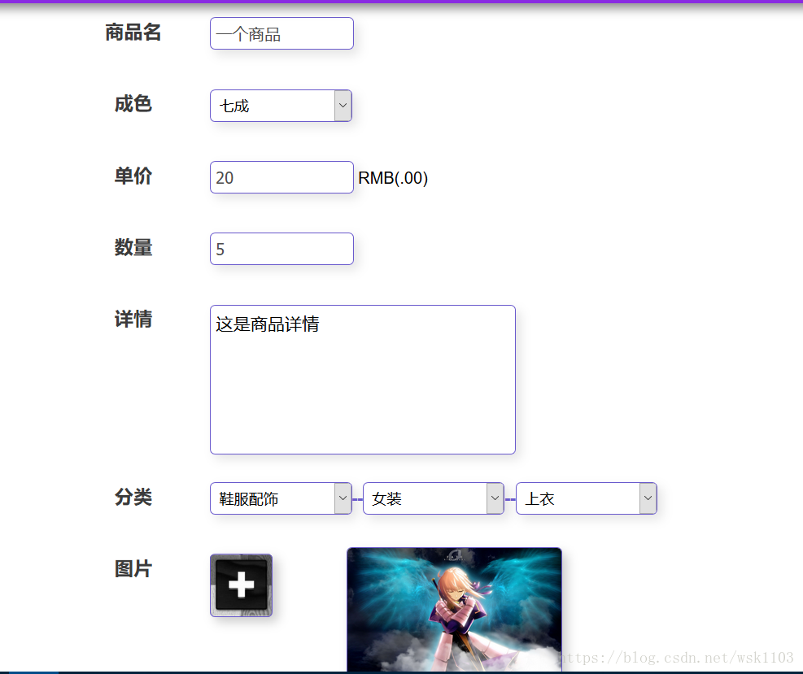

# 基于SSM的校园二手交易平台

Java版本：1.8   
数据库：MySQL  
框架：Spring + Spring MVC + MyBatis  
服务器：Tomcat  
前端解析框架：Thymeleaf  
开发工具：Idea 2017  
版本管理工具：Maven  
版本控制工具：GitHub  

## 实现过程
###  商品首页实现

 

 
其他部分实现效果
 
 

### 3.2.2 二手商城实现

 
	商城商品展示
 

 
 

### 3.2.3 商品详情实现

 
留言
 

### 3.2.4 站内搜索引擎实现

 
搜索结果
 

### 3.2.5 发布商品实现

 
 

 

### 3.2.6 发布求购信息实现

 
### 3.2.7 个人信息页面实现

 
 

### 3.2.8 我发布的商品实现

 
点击修改
 

### 3.2.9我发布的求购信息实现

 
 

### 3.2.10购物车实现

 
点击添加数量和减少
 

### 3.2.11登录注册实现

 
 
 

